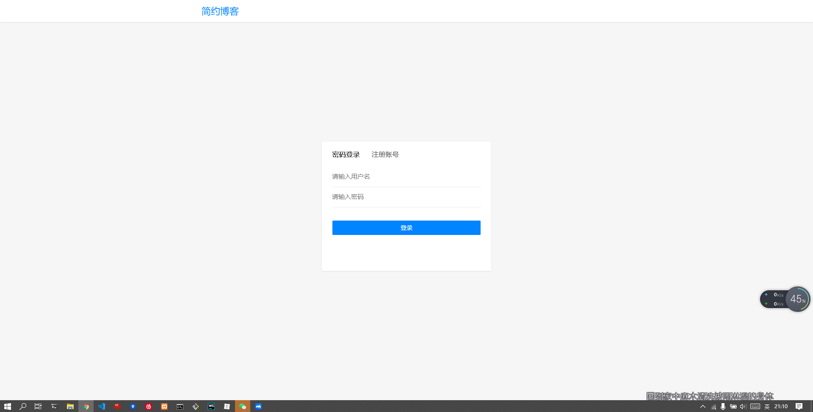
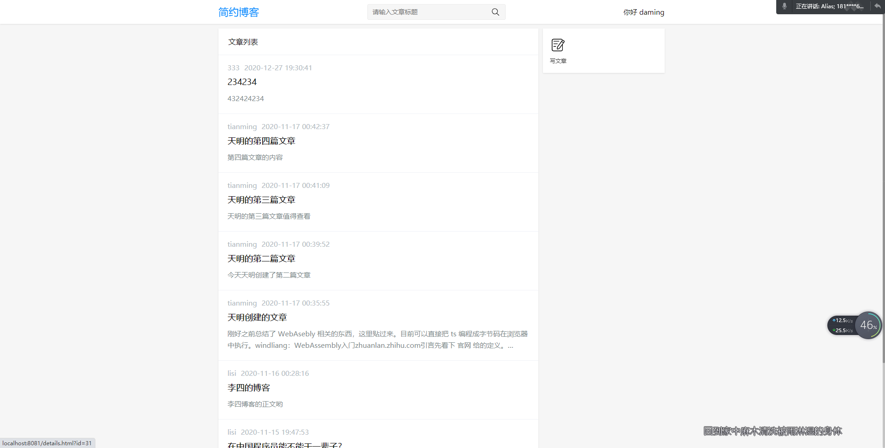
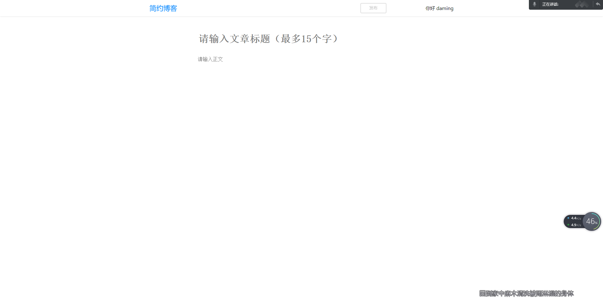
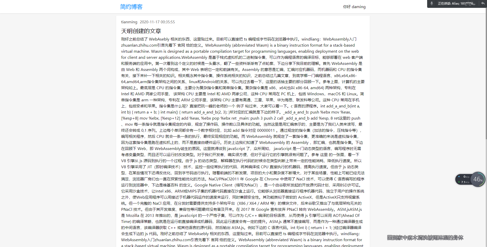
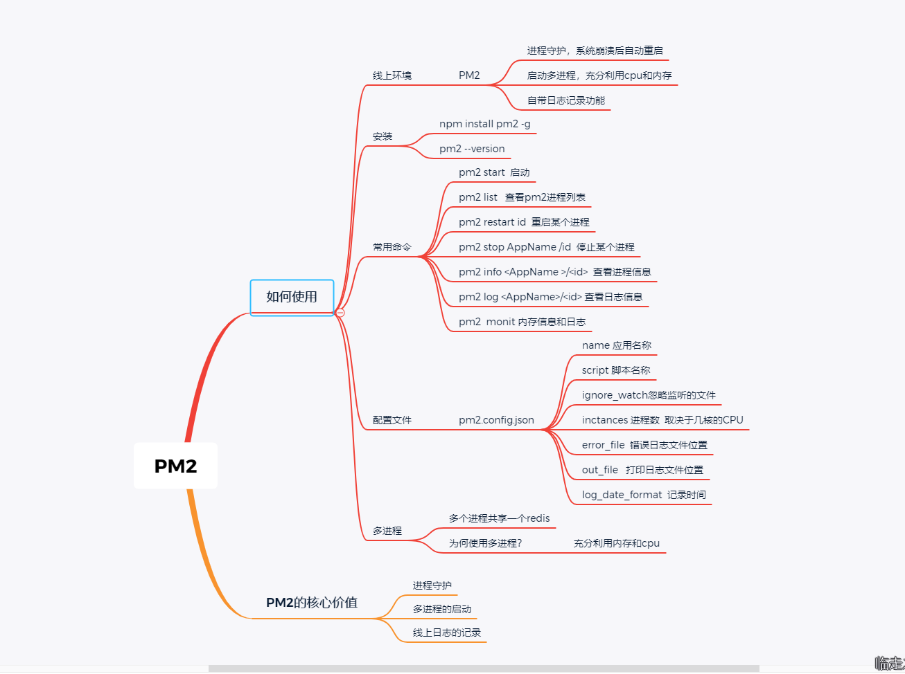

# 原生nodejs构建博客应用

## 下载项目

```bash
1.git clone https://github.com/xiuxiuyifan/nodejs-blog.git
2.安装mysql
3.安装nodejs
4.安装pm2
5.安装redis
```

## 项目截图

### 登录



### 首页

## 

### 添加一篇文章



### 文章详情



## 前端工具

```bash
parcel 一个无需配置的前端工程化工具（只推荐个人项目使用）
```

## nodejs处理http请求
+ DNS解析，建立TCP连接，发送http请求
+ server接收到http请求，处理，并返回
+ 客户端接收到返回数据，处理数据（如渲染页面，执行js）
## 搭建开发环境
+ 从0开始搭搭建不使用任何框架
+ 使用nodemon检测文件变化，自动重启node
+ 使用cross-evn设置环境变量，兼容mac linux 和 windows
```bash
$ yarn add cross-env -D
//添加启动配置package.json文件里面
"scripts": {
    "test": "echo \"Error: no test specified\" && exit 1",
    "dev": "cross-env NODE_ENV=dev nodemon ./bin/www.js"
  },
nodejs 获取启动的环境变量
process.env.NODE_ENV    //通过这个来区分开发环境
```
## 开发接口
+ 根据之前技术方案的设计，做出路由
+ 将路由和处理数据分离，以符合设计原则
## 接口设计
用json的方式给前端进行返回res
1. 获取博客列表
2. 获取一篇博客的内容
3. 新增一篇博客
4. 更新一篇博客
5. 删除一篇博客
6. 登陆
7. 注册

在http服务回调函数里面判断请求方法和请求路径，和自己定义的路径进行匹配，如果命中了，就进行相应的业务处理。
```js
const handleUserRouter = (req,res)=>{
  const method = req.method
  const url = req.url
  const path = url.split('?')[0]
  //登录
  if(method ==='POST' && path === '/api/user/login'){
    return {
      code:200,
      msg:'',
      data:{
      }
    }
  }
}
module.exports = handleUserRouter
设置未命中的路由返回404
res.writeHeader(404,{'Content-type':'text/plain'})
res.write('404 Not Found\n')
res.end()
querystring 解析get 参数
 //解析query
 req.query = querystring.parse(url.split('?')[1])
Promise处理post请求
//获取post请求传递过了的数据，目前只考虑application/json的情况
const getPostData = (req) =>{
  const promise = new Promise((resolve,reject)=>{
    //不是post请求
    if(req.method !=='POST'){
      resolve({})
      return
    }
    if(req.headers['content-type'] !== 'application/json'){
      resolve({})
      return
    }
    var post = '';
    req.on('data', function (chunk) {
      post += chunk;
    });
    req.on('end', function () {
      if(!post){
        resolve({})
        return
      }
      resolve(JSON.stringify(post.toString()))
    });
  })
  return promise
}
  //解析post数据
  getPostData(req)
  .then((postData)=>{
    req.body = postData
  })
```
## 数据库设计
建表
```sql
user
id，用户名，密码，真实姓名
blog
id，博客名称，博客内容，创建时间，博客作者
DROP TABLE IF EXISTS `blog`;
CREATE TABLE `blog`  (
  `id` int(11) NOT NULL AUTO_INCREMENT,
  `title` varchar(64) CHARACTER SET utf8mb4 COLLATE utf8mb4_general_ci NOT NULL COMMENT '标题',
  `content` text CHARACTER SET utf8mb4 COLLATE utf8mb4_general_ci NOT NULL COMMENT '内容',
  `create_time` bigint(20) NOT NULL COMMENT '创建时间',
  `author` varchar(64) CHARACTER SET utf8mb4 COLLATE utf8mb4_general_ci NOT NULL COMMENT '博客作者',
  PRIMARY KEY (`id`) USING BTREE
) ENGINE = InnoDB AUTO_INCREMENT = 14 CHARACTER SET = utf8mb4 COLLATE = utf8mb4_general_ci ROW_FORMAT = Compact;
```
```sql
DROP TABLE IF EXISTS `user`;
CREATE TABLE `user`  (
  `id` int(11) NOT NULL AUTO_INCREMENT COMMENT '主键',
  `username` varchar(64) CHARACTER SET utf8mb4 COLLATE utf8mb4_general_ci NOT NULL COMMENT '用户名',
  `password` varchar(128) CHARACTER SET utf8mb4 COLLATE utf8mb4_general_ci NOT NULL COMMENT '密码',
  `realname` varchar(64) CHARACTER SET utf8mb4 COLLATE utf8mb4_general_ci NOT NULL COMMENT '真实姓名',
  PRIMARY KEY (`id`) USING BTREE
) ENGINE = InnoDB AUTO_INCREMENT = 10 CHARACTER SET = utf8mb4 COLLATE = utf8mb4_general_ci ROW_FORMAT = Compact;
```
## SQL基本操作
```sql
#为了兼容后面如果某些条件不满足的情况SQL报错
where 1=1 
# 用到的基本语句
USE myblog;
#插入语句
INSERT INTO `user` (username,`password`,realname) VALUES ('瓜瓜',12345678,'木瓜')
#查询语句  
SELECT * FROM `user`;
#查询某个字段
SELECT id,username FROM `user`;
#查询条件 WHERE
select * FROM `user` WHERE username='一咻';
#多个条件共存  
#AND
SELECT * FROM `user` WHERE username ='一咻' AND realname = 'wf';
#或者条件  
#OR
SELECT * FROM `user` WHERE username='一咻' OR username='瓜瓜';
#模糊查询  
#LIKE
SELECT * FROM `user` WHERE `password` LIKE '%1%';
#排序
#ORDER BY
#默认情况下是正序  DESC 倒序
SELECT * FROM `user` WHERE `password` LIKE '%1%' ORDER BY id DESC;
#更新,必须添加 WHERE 条件
UPDATE `user` SET realname='木瓜2' WHERE realname='木瓜';
#删除  物理删除
DELETE FROM `user` WHERE realname='木瓜2';
# 逻辑删除
UPDATE `user` SET state='0' WHERE realname='木瓜';
#插入数据
INSERT INTO blog (title,content,create_time,author) VALUES ('文','文章内容4','2020-11-04 19:49:55','一咻');
#修改文章
UPDATE blog SET title='修改文章',content='修改内容' WHERE id=5;
#根据关键字进行查询
SELECT * FROM blog WHERE 1=1 AND author='一咻' AND title LIKE '%文章%' ORDER BY create_time DESC;
#查询博客详情
SELECT * FROM blog WHERE id=1;
#删除博客
DELETE FROM blog WHERE id=5;
# 新增用户
INSERT INTO `user` (username,`password`,realname) VALUES ('一咻',123456,'天明'); 
```

## 查询用户
Nodejs 操作MySQL
封装MySQL
## 登录
+ 登录检验&登录信息存储
+ cookie和session
+ session写入redis
+ 开发登录功能，和前端联调（用nginx反向代理）
## 什么是cookie?
1. 存储在浏览器的一段字符串（最大5kb）
2. 跨域不共享
3. 格式k1=v1;k2=v2;因此可以存储结构化数据
4. 每次发送http请求，会将请求域的cookie一起发送给server
5. server 可以修改cookie并返回给浏览器
6. 浏览器中也可以通过javascript修改cookie（有限制）
7. 在server端锁死一段cookie,不让客户端进行修改。
## server 端nodejs操作cookie
```js
//解析cooike为json的形式
const parsingCookie = (req) => {
  let cookieStr = req.headers.cookie || ''
  let list = cookieStr.split(';')
  let cookie = {}
  list.forEach((item,index)=>{
    if(!item) return
    let arr = item.split('=')
    let key = arr[0].trim()    //去掉cookie拼接时候的空格
    let value = arr[0].trim()
    cookie[key] = value
  })
  return cookie
}
```
> 设置cookie值的时候不可以设置中文（utf-8字符集编码）
倒腾了半夜也没找到方案，其实是http协议的Header头有字符限制，下图是stackoverflow的解答，http的header字符集支持US-ASCII子集的字符集，故设置中文是'utf8'时就会报上面错误。
把字符串转成base64即可。
```js
this.cookies.set('test', new Buffer('我是koajs').toString('base64'))
base64转到字符串
new Buffer(str, 'base64').toString();//str是base64编码的字符串
查看cookie
修改cookie
```
实现登陆验证
```js
return userLogin(username,password).then((dbData)=>{
  if(dbData.username){
    res.setHeader('Set-cookie',`username=yixiu;path=/;httpOnly`)
    return new SuccessVo('登陆成功',true)
  }
  return new ErrorVo('登陆失败', false)
})
```
### Cookie的五个属性 
#### HttpOnly
1. 基于安全的考虑，需要给cookie加上Secure和HttpOnly属性，HttpOnly比较好理解，设置HttpOnly=true的cookie不能被js获取到，无法用document.cookie打出cookie的内容。
#### Secure
2. Secure属性是说如果一个cookie被设置了Secure=true，那么这个cookie只能用https协议发送给服务器，用http协议是不发送的。换句话说，cookie是在https的情况下创建的，而且他的Secure=true，那么之后你一直用https访问其他的页面（比如登录之后点击其他子页面），cookie会被发送到服务器，你无需重新登录就可以跳转到其他页面。但是如果这是你把url改成http协议访问其他页面，你就需要重新登录了，因为这个cookie不能在http协议中发送。
举例说明
前提条件：https://localhost:9102应用对cookie设置了Secure=true
1. 访问 https://localhost:9102/manager
2. 输入用户名、密码，用IE或者Chrome的developer tool会看到response的header里，set-cookie的值里有Secure属性
3. 登录后，继续访问https://localhost:9102/manager#user，可以正常看到内容
4. 修改url，访问http://localhost:9100/manager#domain，会跳转到登录页面，因为cookie在http协议下不发送给服务器，服务器要求用户重新登录
#### expires
设置过期时间
expires选项用来设置“cookie 什么时间内有效”。expires其实是cookie失效日期，expires必须是 GMT 格式的时间（可以通过new Date().toGMTString()或者 new Date().toUTCString() 来获得）
如果没有设置该选项，则默认有效期为session，即会话cookie。这种cookie在浏览器关闭后就没有了。
#### SameSite 
浏览器的 Cookie 新增加了一个SameSite属性，用来防止 CSRF 攻击和用户追踪。
#### Priority
优先级，chrome的提案，定义了三种优先级，Low/Medium/High，当cookie数量超出时，低优先级的cookie会被优先清除
## session
cookie存在的问题，会暴露username，和一些用户相关的隐私信息。
cookie中存储userid , server端对应username，把对应关系放到session中
cookie中放置一个无用的信息，发送给server端进行解析出对应的用户信息
✅js内存中存放session?
参考commit 中
## redis中集中管理session
### 为什么session适合使用redis？
session访问频繁，对性能要求极高。
session可不考虑断电丢失数据的问题（内存的硬伤）
session数据量不会很大（相比于mysql中储存的数据）
```js
nodejs 链接redis
let needSetCookie = false
  let userId = req.cookie.userid
  //只要cookie中没有userid 就把redis中的session设置为 {}
  //并生成新的 userId 
  if (!userId) {
    needSetCookie = true
    //需要设置cookie 
    userId = new Date().getTime() + Math.random()
    //初始化sessionData
    setRedis(userId, {})
  }
  req.sessionId = userId
  getRedis(req.sessionId)
    .then((sessionData) => {
      if (sessionData == null) {
        //初始化redis 中的session
        setRedis(userId, {})
        //设置session
        req.session = {}
      } else {
        req.session = sessionData
      }
      return getPostData(req)
    })
```
用户是否登录鉴权中间件抽离
## nginx 
```bash
#进程数  cpu 是双核的
worker_processes 2;
location / {
    proxy_pass http://localhost:8081;
}
location /api/ {
    proxy_pass http://localhost:8080;
  proxy_set_header Host $host; 
}
```
## CORS

## 简单请求

## 非简单请求

## 跨域携带cookie

## 日志

+ 访问日志（server端最重要的日志）
+ 自定义日志（自定义事件、错误记录）
## nodejs文件操作(stream流的方式)
+ nodejs 文件操作，nodejs stream
+ 日志功能开发和使用
+ 日志文件拆分，日志内容分析
```js
const fs = require('fs')
const path = require('path')
//复制文件
let filePath = path.resolve(__dirname,'data.txt')
let filePath1 = path.resolve(__dirname,'copy-data.txt')
let readFileStream = fs.createReadStream(filePath)
let writeFileStream = fs.createWriteStream(filePath1)
//将读取文件流用管道和写入文件流连接起来
readFileStream.pipe(writeFileStream)
readFileStream.on('data',function(chunk){
  console.log(chunk.toString())
})
readFileStream.on('end',function(){
  console.log('copy end')
})
//http请求返回文件
const fs = require('fs')
const http = require('http')
let httpServer = http.createServer(function(req,res){
  let file = fs.createReadStream('data.txt')
  file.pipe(res)
})
httpServer.listen(9000)
```
## 上线配置
### 开始和PM2介绍
### 常用命令
### 进程守护
### 常用配置
### 多进程



## 阮一峰文章

[跨域共享资源](http://www.ruanyifeng.com/blog/2016/04/cors.html)

[cookie](http://www.w3cbus.com/bom/cookie.html)